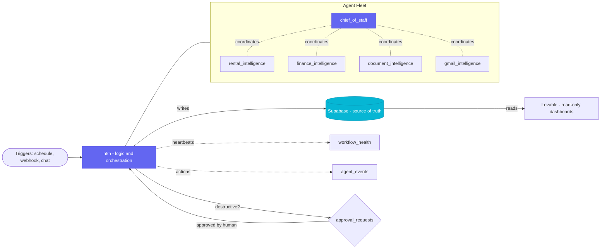
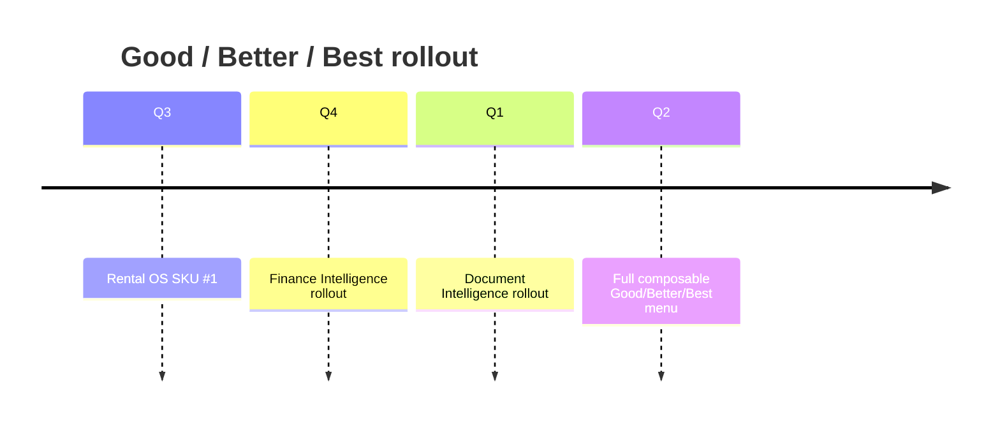

<!-- Profile README for ShadowAgents (Jason Vineis). -->

  

  

  
  
  

## What I do

I design and operate reliable AI agent fleets - ~13 production agents across finance, rentals, documents, calendar, and email that coordinate to run real operations, not demos. Governed by design: deterministic logic first, AI second, with heartbeats, event logs, and human approval gates on every agent.

  
  
  

---

## Architecture

---

## See it run

<!-- Demo options: 1) Add a GIF at assets/demo.gif and replace the badge above with:   2) Or drag-drop an MP4 directly into this README in the GitHub editor and GitHub will render a native video player. -->

---

## How approvals work

  
<strong>Proof-of-governance audit trail (sanitized example)</strong>

- `approval_request` created for a destructive-action candidate
- Human reviewer approves the request
- Action executes through the orchestrated workflow
- `agent_events` records the action metadata
- `workflow_health` receives the updated heartbeat state

---

## Tech toolbox

  
  
  
  
  
  
  
  
  

---

## Roadmap

---

## How I'd build yours in 30 days

1. **Discover** - map one high-friction operational workflow worth automating.
2. **Build** - ship one governed, approval-gated agent into production.
3. **Prove** - measure reliability, speed, and decision quality on real operations.

---

## Activity

  

---

## Contact

<em>Reliability beats cleverness. Simplicity beats over-engineering.</em>

<!-- STAGED TODO (invisible by design):
  #1 Live fleet-status dynamic badge from public sanitized JSON
  #2 Self-updating README via GitHub Action markers
  #6 Self-hosted animated SVG hero (light/dark variants)
  #7 Custom KPI SVG card sourced from public sanitized metrics
-->
